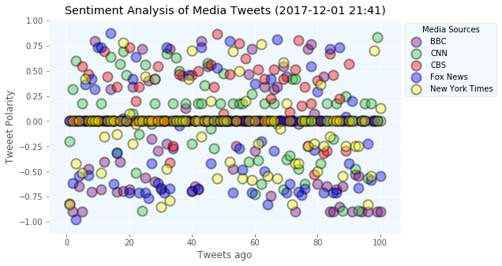
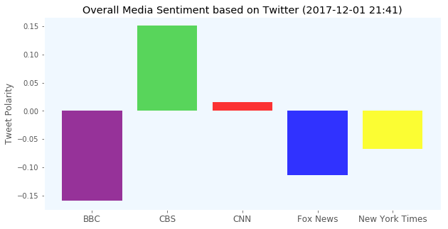

```python
# Dependencies
import tweepy
import numpy as np
import pandas as pd
from datetime import datetime
import matplotlib.pyplot as plt
from matplotlib import style
style.use('ggplot')

# Import and Initialize Sentiment Analyzer
from vaderSentiment.vaderSentiment import SentimentIntensityAnalyzer
analyzer = SentimentIntensityAnalyzer()

# Twitter API Keys
from config import (consumer_key, 
                    consumer_secret, 
                    access_token, 
                    access_token_secret)

# Setup Tweepy API Authentication
auth = tweepy.OAuthHandler(consumer_key, consumer_secret)
auth.set_access_token(access_token, access_token_secret)
api = tweepy.API(auth, parser=tweepy.parsers.JSONParser())

```


```python
#"@BBC", "@CNN", "@CBS","@FoxNews", "@nytimes"
# Target Search Term
target_term = "@BBCNews"

# Lists to hold sentiments
BBC_list = []

counter=1

# Grab 100 tweets
public_tweets = api.search(target_term, count=100, result_type="recent", since_id=None)

# Loop through all tweets
for tweet in public_tweets["statuses"]:

    # Run Vader Analysis on each tweet
    results = analyzer.polarity_scores(tweet["text"])
    compound = results["compound"]
    pos = results["pos"]
    neu = results["neu"]
    neg = results["neg"]

    # Add each value to the appropriate array
    BBC_list.append({"Twitter Account":target_term,"Date": tweet["created_at"], 
                           "Compound": compound,
                           "Positive": pos,
                           "Negative": neu,
                           "Neutral": neg,
                           "Tweets Ago": counter})
     # Add to counter 
    counter = counter + 1
```


```python
BBC_pd = pd.DataFrame.from_dict(BBC_list)
BBC_pd.head()
```


<div>
<style>
    .dataframe thead tr:only-child th {
        text-align: right;
    }

    .dataframe thead th {
        text-align: left;
    }

    .dataframe tbody tr th {
        vertical-align: top;
    }
</style>
<table border="1" class="dataframe">
  <thead>
    <tr style="text-align: right;">
      <th></th>
      <th>Compound</th>
      <th>Date</th>
      <th>Negative</th>
      <th>Neutral</th>
      <th>Positive</th>
      <th>Tweets Ago</th>
      <th>Twitter Account</th>
    </tr>
  </thead>
  <tbody>
    <tr>
      <th>0</th>
      <td>-0.8176</td>
      <td>Sat Dec 02 03:36:09 +0000 2017</td>
      <td>0.615</td>
      <td>0.385</td>
      <td>0.0</td>
      <td>1</td>
      <td>@BBCNews</td>
    </tr>
    <tr>
      <th>1</th>
      <td>-0.9001</td>
      <td>Sat Dec 02 03:34:36 +0000 2017</td>
      <td>0.421</td>
      <td>0.579</td>
      <td>0.0</td>
      <td>2</td>
      <td>@BBCNews</td>
    </tr>
    <tr>
      <th>2</th>
      <td>0.0000</td>
      <td>Sat Dec 02 03:34:20 +0000 2017</td>
      <td>1.000</td>
      <td>0.000</td>
      <td>0.0</td>
      <td>3</td>
      <td>@BBCNews</td>
    </tr>
    <tr>
      <th>3</th>
      <td>-0.6486</td>
      <td>Sat Dec 02 03:33:50 +0000 2017</td>
      <td>0.736</td>
      <td>0.264</td>
      <td>0.0</td>
      <td>4</td>
      <td>@BBCNews</td>
    </tr>
    <tr>
      <th>4</th>
      <td>-0.9001</td>
      <td>Sat Dec 02 03:33:47 +0000 2017</td>
      <td>0.421</td>
      <td>0.579</td>
      <td>0.0</td>
      <td>5</td>
      <td>@BBCNews</td>
    </tr>
  </tbody>
</table>
</div>


```python
#"@BBCNews", "@CNN", "@CBS","@FoxNews", "@nytimes"
# Target Search Term
target_term = "@CNN"

# Lists to hold sentiments
CNN_list = []

counter=1

# Grab 100 tweets
public_tweets = api.search(target_term, count=100, result_type="recent", since_id=None)

# Loop through all tweets
for tweet in public_tweets["statuses"]:

    # Run Vader Analysis on each tweet
    results = analyzer.polarity_scores(tweet["text"])
    compound = results["compound"]
    pos = results["pos"]
    neu = results["neu"]
    neg = results["neg"]

    # Add each value to the appropriate array
    CNN_list.append({"Twitter Account":target_term,"Date": tweet["created_at"], 
                           "Compound": compound,
                           "Positive": pos,
                           "Negative": neu,
                           "Neutral": neg,
                           "Tweets Ago": counter})
     # Add to counter 
    counter = counter + 1
```


```python
CNN_pd = pd.DataFrame.from_dict(CNN_list)
CNN_pd.head()
```


<div>
<style>
    .dataframe thead tr:only-child th {
        text-align: right;
    }

    .dataframe thead th {
        text-align: left;
    }

    .dataframe tbody tr th {
        vertical-align: top;
    }
</style>
<table border="1" class="dataframe">
  <thead>
    <tr style="text-align: right;">
      <th></th>
      <th>Compound</th>
      <th>Date</th>
      <th>Negative</th>
      <th>Neutral</th>
      <th>Positive</th>
      <th>Tweets Ago</th>
      <th>Twitter Account</th>
    </tr>
  </thead>
  <tbody>
    <tr>
      <th>0</th>
      <td>-0.2023</td>
      <td>Sat Dec 02 03:07:31 +0000 2017</td>
      <td>0.899</td>
      <td>0.101</td>
      <td>0.000</td>
      <td>1</td>
      <td>@CNN</td>
    </tr>
    <tr>
      <th>1</th>
      <td>0.3182</td>
      <td>Sat Dec 02 03:07:29 +0000 2017</td>
      <td>0.859</td>
      <td>0.000</td>
      <td>0.141</td>
      <td>2</td>
      <td>@CNN</td>
    </tr>
    <tr>
      <th>2</th>
      <td>0.5994</td>
      <td>Sat Dec 02 03:07:28 +0000 2017</td>
      <td>0.380</td>
      <td>0.000</td>
      <td>0.620</td>
      <td>3</td>
      <td>@CNN</td>
    </tr>
    <tr>
      <th>3</th>
      <td>0.0000</td>
      <td>Sat Dec 02 03:07:28 +0000 2017</td>
      <td>1.000</td>
      <td>0.000</td>
      <td>0.000</td>
      <td>4</td>
      <td>@CNN</td>
    </tr>
    <tr>
      <th>4</th>
      <td>0.1779</td>
      <td>Sat Dec 02 03:07:27 +0000 2017</td>
      <td>0.855</td>
      <td>0.000</td>
      <td>0.145</td>
      <td>5</td>
      <td>@CNN</td>
    </tr>
  </tbody>
</table>
</div>


```python
#"@BBCNews", "@CNN", "@CBS","@FoxNews", "@nytimes"
# Target Search Term
target_term = "@CBS"

# Lists to hold sentiments
CBS_list = []

counter=1

# Grab 100 tweets
public_tweets = api.search(target_term, count=100, result_type="recent", since_id=None)

# Loop through all tweets
for tweet in public_tweets["statuses"]:

    # Run Vader Analysis on each tweet
    results = analyzer.polarity_scores(tweet["text"])
    compound = results["compound"]
    pos = results["pos"]
    neu = results["neu"]
    neg = results["neg"]

    # Add each value to the appropriate array
    CBS_list.append({"Twitter Account":target_term,"Date": tweet["created_at"], 
                           "Compound": compound,
                           "Positive": pos,
                           "Negative": neu,
                           "Neutral": neg,
                           "Tweets Ago": counter})
     # Add to counter 
    counter = counter + 1
```


```python
CBS_pd = pd.DataFrame.from_dict(CBS_list)
CBS_pd.head()
```


<div>
<style>
    .dataframe thead tr:only-child th {
        text-align: right;
    }

    .dataframe thead th {
        text-align: left;
    }

    .dataframe tbody tr th {
        vertical-align: top;
    }
</style>
<table border="1" class="dataframe">
  <thead>
    <tr style="text-align: right;">
      <th></th>
      <th>Compound</th>
      <th>Date</th>
      <th>Negative</th>
      <th>Neutral</th>
      <th>Positive</th>
      <th>Tweets Ago</th>
      <th>Twitter Account</th>
    </tr>
  </thead>
  <tbody>
    <tr>
      <th>0</th>
      <td>0.0000</td>
      <td>Sat Dec 02 03:07:05 +0000 2017</td>
      <td>1.000</td>
      <td>0.0</td>
      <td>0.000</td>
      <td>1</td>
      <td>@CBS</td>
    </tr>
    <tr>
      <th>1</th>
      <td>0.0000</td>
      <td>Sat Dec 02 03:06:56 +0000 2017</td>
      <td>1.000</td>
      <td>0.0</td>
      <td>0.000</td>
      <td>2</td>
      <td>@CBS</td>
    </tr>
    <tr>
      <th>2</th>
      <td>0.0000</td>
      <td>Sat Dec 02 03:06:44 +0000 2017</td>
      <td>1.000</td>
      <td>0.0</td>
      <td>0.000</td>
      <td>3</td>
      <td>@CBS</td>
    </tr>
    <tr>
      <th>3</th>
      <td>0.0000</td>
      <td>Sat Dec 02 03:06:41 +0000 2017</td>
      <td>1.000</td>
      <td>0.0</td>
      <td>0.000</td>
      <td>4</td>
      <td>@CBS</td>
    </tr>
    <tr>
      <th>4</th>
      <td>0.5413</td>
      <td>Sat Dec 02 03:06:19 +0000 2017</td>
      <td>0.811</td>
      <td>0.0</td>
      <td>0.189</td>
      <td>5</td>
      <td>@CBS</td>
    </tr>
  </tbody>
</table>
</div>


```python
#"@BBC", "@CNN", "@CBS","@FoxNews", "@nytimes"
# Target Search Term
target_term = "@FoxNews"

# Lists to hold sentiments
Fox_list = []

counter=1

# Grab 100 tweets
public_tweets = api.search(target_term, count=100, result_type="recent", since_id=None)

# Loop through all tweets
for tweet in public_tweets["statuses"]:

    # Run Vader Analysis on each tweet
    results = analyzer.polarity_scores(tweet["text"])
    compound = results["compound"]
    pos = results["pos"]
    neu = results["neu"]
    neg = results["neg"]

    # Add each value to the appropriate array
    Fox_list.append({"Twitter Account":target_term,"Date": tweet["created_at"], 
                           "Compound": compound,
                           "Positive": pos,
                           "Negative": neu,
                           "Neutral": neg,
                           "Tweets Ago": counter})
     # Add to counter 
    counter = counter + 1
```


```python
Fox_pd = pd.DataFrame.from_dict(Fox_list)
Fox_pd.head()
```


<div>
<style>
    .dataframe thead tr:only-child th {
        text-align: right;
    }

    .dataframe thead th {
        text-align: left;
    }

    .dataframe tbody tr th {
        vertical-align: top;
    }
</style>
<table border="1" class="dataframe">
  <thead>
    <tr style="text-align: right;">
      <th></th>
      <th>Compound</th>
      <th>Date</th>
      <th>Negative</th>
      <th>Neutral</th>
      <th>Positive</th>
      <th>Tweets Ago</th>
      <th>Twitter Account</th>
    </tr>
  </thead>
  <tbody>
    <tr>
      <th>0</th>
      <td>0.0000</td>
      <td>Sat Dec 02 03:07:52 +0000 2017</td>
      <td>1.000</td>
      <td>0.000</td>
      <td>0.000</td>
      <td>1</td>
      <td>@FoxNews</td>
    </tr>
    <tr>
      <th>1</th>
      <td>-0.6124</td>
      <td>Sat Dec 02 03:07:52 +0000 2017</td>
      <td>0.773</td>
      <td>0.227</td>
      <td>0.000</td>
      <td>2</td>
      <td>@FoxNews</td>
    </tr>
    <tr>
      <th>2</th>
      <td>-0.9721</td>
      <td>Sat Dec 02 03:07:52 +0000 2017</td>
      <td>0.407</td>
      <td>0.549</td>
      <td>0.044</td>
      <td>3</td>
      <td>@FoxNews</td>
    </tr>
    <tr>
      <th>3</th>
      <td>-0.5423</td>
      <td>Sat Dec 02 03:07:51 +0000 2017</td>
      <td>0.821</td>
      <td>0.179</td>
      <td>0.000</td>
      <td>4</td>
      <td>@FoxNews</td>
    </tr>
    <tr>
      <th>4</th>
      <td>0.0000</td>
      <td>Sat Dec 02 03:07:51 +0000 2017</td>
      <td>1.000</td>
      <td>0.000</td>
      <td>0.000</td>
      <td>5</td>
      <td>@FoxNews</td>
    </tr>
  </tbody>
</table>
</div>


```python
#"@BBCNews", "@CNN", "@CBS","@FoxNews", "@nytimes"
# Target Search Term
target_term = "@nytimes"

# Lists to hold sentiments
NYT_list = []

counter=1

# Grab 100 tweets
public_tweets = api.search(target_term, count=100, result_type="recent", since_id=None)

# Loop through all tweets
for tweet in public_tweets["statuses"]:

    # Run Vader Analysis on each tweet
    results = analyzer.polarity_scores(tweet["text"])
    compound = results["compound"]
    pos = results["pos"]
    neu = results["neu"]
    neg = results["neg"]

    # Add each value to the appropriate array
    NYT_list.append({"Twitter Account":target_term,"Date": tweet["created_at"], 
                           "Compound": compound,
                           "Positive": pos,
                           "Negative": neu,
                           "Neutral": neg,
                           "Tweets Ago": counter})
     # Add to counter 
    counter = counter + 1
```


```python
NYT_pd = pd.DataFrame.from_dict(NYT_list)
NYT_pd.head()
```


<div>
<style>
    .dataframe thead tr:only-child th {
        text-align: right;
    }

    .dataframe thead th {
        text-align: left;
    }

    .dataframe tbody tr th {
        vertical-align: top;
    }
</style>
<table border="1" class="dataframe">
  <thead>
    <tr style="text-align: right;">
      <th></th>
      <th>Compound</th>
      <th>Date</th>
      <th>Negative</th>
      <th>Neutral</th>
      <th>Positive</th>
      <th>Tweets Ago</th>
      <th>Twitter Account</th>
    </tr>
  </thead>
  <tbody>
    <tr>
      <th>0</th>
      <td>-0.8225</td>
      <td>Sat Dec 02 03:07:56 +0000 2017</td>
      <td>0.652</td>
      <td>0.348</td>
      <td>0.0</td>
      <td>1</td>
      <td>@nytimes</td>
    </tr>
    <tr>
      <th>1</th>
      <td>0.0000</td>
      <td>Sat Dec 02 03:07:53 +0000 2017</td>
      <td>1.000</td>
      <td>0.000</td>
      <td>0.0</td>
      <td>2</td>
      <td>@nytimes</td>
    </tr>
    <tr>
      <th>2</th>
      <td>-0.4215</td>
      <td>Sat Dec 02 03:07:52 +0000 2017</td>
      <td>0.823</td>
      <td>0.177</td>
      <td>0.0</td>
      <td>3</td>
      <td>@nytimes</td>
    </tr>
    <tr>
      <th>3</th>
      <td>0.0000</td>
      <td>Sat Dec 02 03:07:50 +0000 2017</td>
      <td>1.000</td>
      <td>0.000</td>
      <td>0.0</td>
      <td>4</td>
      <td>@nytimes</td>
    </tr>
    <tr>
      <th>4</th>
      <td>-0.5106</td>
      <td>Sat Dec 02 03:07:49 +0000 2017</td>
      <td>0.852</td>
      <td>0.148</td>
      <td>0.0</td>
      <td>5</td>
      <td>@nytimes</td>
    </tr>
  </tbody>
</table>
</div>


```python
# create data
x1 = BBC_pd["Tweets Ago"]
y1 = BBC_pd["Compound"]
x2 = CNN_pd["Tweets Ago"]
y2 = CNN_pd["Compound"]
x3 = CBS_pd["Tweets Ago"]
y3 = CBS_pd["Compound"]
x4 = Fox_pd["Tweets Ago"]
y4 = Fox_pd["Compound"]
x5 = NYT_pd["Tweets Ago"]
y5 = NYT_pd["Compound"]


# create the scatter graph
plt.figure(figsize=(8,5))
plt.scatter(x1, y1, color="purple", edgecolors="black", marker="o", linewidth= 2, alpha=0.4, s =150, label='BBC')
plt.scatter(x2, y2, color="limegreen", edgecolors="black", marker="o", linewidth= 2, alpha=0.4, s =150, label='CNN')
plt.scatter(x3, y3, color="red", edgecolors="black", marker="o", linewidth= 2, alpha=0.4,s =150, label='CBS')
plt.scatter(x4, y4, color="blue", edgecolors="black", marker="o", linewidth= 2, alpha=0.4,s =150, label='Fox News')
plt.scatter(x5, y5, color="yellow", edgecolors="black", marker="o", linewidth= 2, alpha=0.4,s =150,label='New York Times')

plt.xlabel('Tweets ago')
plt.ylabel('Tweeet Polarity')
plt.title(f"Sentiment Analysis of Media Tweets ({datetime.now().strftime('%Y-%m-%d %H:%M')})")
plt.rcParams['axes.facecolor'] = 'aliceblue'
plt.grid(True)
plt.legend(bbox_to_anchor=(1,1), loc="best", ncol=1, title="Media Sources")


plt.savefig('Twitter.png')
plt.show()
```





```python
# Average Compound core 
BBC_mean=np.mean(BBC_pd['Compound'])
CNN_mean=np.mean(CNN_pd['Compound'])
CBS_mean=np.mean(CBS_pd['Compound'])
Fox_mean=np.mean(Fox_pd['Compound'])
NY_mean=np.mean(NYT_pd['Compound'])
```


```python
# Creat a bar graph
y_axis=[BBC_mean,CBS_mean,CNN_mean,Fox_mean,NY_mean]
x_axis=np.arange(len(y_axis))
plt.figure(figsize=(10,5))
plt.bar(0, BBC_mean, color='purple', align="edge", alpha=0.8)
plt.bar(1, CBS_mean, color='limegreen', align="edge", alpha=0.8)
plt.bar(2, CNN_mean, color='red', align="edge", alpha=0.8)
plt.bar(3, Fox_mean, color='blue', align="edge", alpha=0.8)
plt.bar(4, NY_mean, color='yellow', align="edge", alpha=0.8)
tick_locations=[i+0.4 for i in x_axis] 
plt.xticks(tick_locations,["BBC","CBS","CNN","Fox News","New York Times"],size="large")
plt.title(f"Overall Media Sentiment based on Twitter ({datetime.now().strftime('%Y-%m-%d %H:%M')})")
plt.ylabel("Tweet Polarity")
plt.grid(False)
plt.savefig("Twitter Sentiment.png")
plt.show()
```





# Three Trends

* Based on the Bar graph result, BBC news has the highest negative Sentiment score, and CBS has the highest positive Sentiment score.  
* Based on the Scatter plot result, all media news tweets received neutral scores that can't be analysized as either positive or negative
* Based on the Scatter plot and Bar graph results, overall tweets posted on news media twitter are generally negative.
